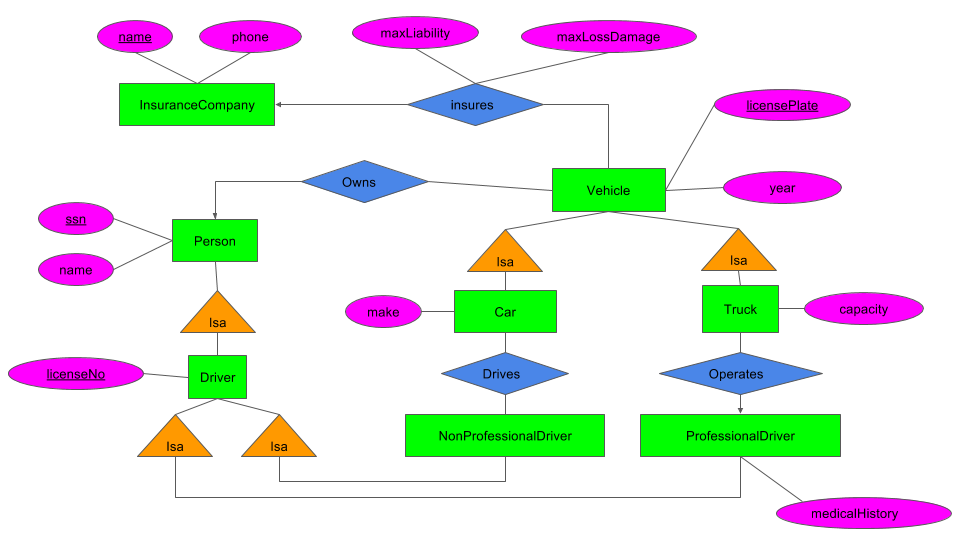

# CSEP 544 Homework 7: Entity Relationship Diagrams and Conceptual Design

**Objectives:**
To be able to translate from entity relationship diagrams to a relational database, and to understand functional dependencies and normal forms.

**Assignment tools:**
- Pen and paper or any drawing tools you prefer (e.g., powerpoint, [draw.io](https://www.draw.io)) for part 1
- SQLite (or any other relational DBMS) for part 2.

**Assigned date:** Tuesday, Nov 14, 2017

**Due date:** Tuesday, Nov 21, 2017 at 11:59pm. You have 1 week for this assignment.

**What to turn in:**
- `hw7-part1.pdf`: A pdf containing some diagrams, some short decompositions, some free response questions
- `hw7-part2.sql`: A commented sql file

**Resources:** 

Textbook chapter 3.1-3.4, 4.1-4.6

## Assignment Details

### Part 1: Theory

Turn in all of your answers for Part 1 in a PDF named hw7-part1.pdf, which should include 2 questions with an ER diagram, some SQL statements, some free response, and some algebra.

1. (10 points) Design an E/R diagram for geography that contains the following kinds of objects or entities together with the listed attributes. 

    Model the relationships between the objects with edges. Note that edges between entities can be labeled with constraints. Make sure to label only the/those primary key(s) that is/are mentioned below.

    **Entities**
    - countries (with attributes): name, area, population, gdp ("gross domestic product")
      - a country's name uniquely identifies the country within all countries
    - cities: name, population, longitude, latitude
      - a city is uniquely identified by its (longitude, latitude) (not by name, since for instance there are 41 different cities and towns are named Springfield in the US!)
    - rivers: name, length
    - seas: name, max depths
      - rivers and seas are uniquely identified within all water entities by their name (e.g., "Ganges" would be a unique water entity)

    **Relationships:**
    - each city belongs to exactly one country
    - each river crosses one or several countries
    - each country can be crossed by zero or several rivers
    - each river ends in either a river or in a sea

    You can draw your diagrams on paper and scan them, take *quality* pictures of your drawn diagram, or use your favorite drawing tool such as Powerpoint, Keynote, or [draw.io](https://www.draw.io/). (FYI: Google Slides lacks a few shapes that you might need such as rounded arrows.)


2. (20 points) Consider the following E/R diagram: 

    
    
    Note: *License plate* numbers can have both letters and numbers in them.  *License* numbers only contain numbers. *Social Security* numbers are only made up with numbers. 
    - Translate the diagram above by writing the SQL `CREATE TABLE` statements to represent this E/R diagram. Include all key constraints; you should specify both primary and foreign keys. Make sure that your statements are syntactically correct (you might want to check them using sqlite / Azure for instance). (10 points)
    - Which relation in your relational schema represents the relationship "insures" in the E/R diagram and why is that your representation? (5 points)
    - Compare the representation of the relationships "drives" and "operates" in your schema, and explain why they are different. (5 points)


3. (20 points) Consider the following two relational schemas and sets of functional dependencies:
    - R(A,B,C,D,E) with functional dependencies D → B, CE → A.
    - S(A,B,C,D,E) with functional dependencies A → E, BC → A, DE → B.
    
    For each of the above schemas, decompose it into BCNF. Show all of your work and explain, at each step, which dependency violations you are correcting. Make sure you describe each step in your decomposition steps. (10 points each)


4. (15 points) A set of attributes X is called closed (with respect to a given set of functional dependencies) if X+=X. Consider a relation with schema R(A,B,C,D) and an unknown set of functional dependencies. For each closed attribute set below, give a set of functional dependencies that is consistent with it.
    - All sets of attributes are closed.
    - The only closed sets are {} and {A,B,C,D}.
    - The only closed sets are {}, {A,B}, and {A,B,C,D}.


### Part 2: Application

Mr. Frumble (35 points) 

**Description**

[Mr. Frumble](http://everythingbusytown.wikia.com/wiki/Mr._Frumble) (a great character for small kids who always gets into trouble) designed a simple database to record projected monthly sales in his small store. He never took a database class, so he came up with the following schema:

``Sales(name, discount, month, price)``

He inserted his data into the database, then he realized that there is something wrong with it: it was difficult to update. He hires you as a consultant to fix his data management problems. He gives you this file [mrFrumbleData.txt](https://courses.cs.washington.edu/courses/cse344/mrFrumbleData.txt) and says: "Fix it for me!". Help him by normalizing his database. Unfortunately you cannot sit down and talk to Mr. Frumble to find out what functional dependencies make sense in his business. Instead, you will reverse engineer the functional dependencies from his data instance. You should do the following steps:

**Questions**

For all of the following questions, put your responses into `hw7-part2.sql`. You will be writing SQL queries and then responding to the questions in comments.

1. Create a table in the database and load the data from the provided file into that table; use SQLite or any other relational DBMS if your choosing. You don't need to turn in anything for this point.

2. Find all nontrivial functional dependencies in the database.
This is a reverse engineering task, so expect to proceed in a trial and error fashion. Search first for the simple dependencies, say name → discount then try the more complex ones, like name, discount → month, as needed. To check each functional dependency you have to write a SQL query. 

    Your challenge is to write this SQL query for every candidate functional dependency that you check, such that:
    
     a. the query's answer is always short (say: no more than ten lines - remember that 0 results can be instructive as well)
     
     b. you can determine whether the FD holds or not by looking at the query's answer. Try to be clever in order not to check too many dependencies, but don't miss potential relevant dependencies. For example, if you have A → B and C → D, you do not need to derive AC → BD as well.


    For this part you should turn in all functional dependencies that you found, and for each of them the SQL query that discovered it, together with the answer of the query (remember short queries are preferred).

3. Decompose the table in BCNF, and create SQL tables for the decomposed schema. Create keys and foreign keys where appropriate.
    
    For this part turn in the SQL commands for creating the tables.

4. Populate your BCNF tables from Mr. Frumble's data. For this you need to write SQL queries that load the tables you created in part 3. from the table you created in part 1.

    Here, turn in the SQL queries that load the tables, and count the size of the tables after loading them (obtained by running ``SELECT COUNT(*)  FROM Table``).

Again, include your answers to be above questions in `hw7-part2.sql` using comments and SQL queries, and add it to your repository.


## Submission Instructions

For Part 1, write your answers in a file `hw7-part1.pdf`.
For Part 2, write your answers in a file `hw7-part2.sql`.

**Important**: To remind you, in order for your answers to be added to the git repo, 
you need to explicitly add each file:

```sh
$ git add hw7-part1.pdf ...
```

**Again, just because your code has been committed on your local machine does not mean that it has been 
submitted -- it needs to be on GitLab!**

Use the same bash script `turnInHw.sh` in the root level directory of your repository that 
commits your changes, deletes any prior tag for the current lab, tags the current commit,
and pushes the branch and tag to GitLab. 

If you are using Linux or Mac OSX, you should be able to run the following:

```sh
$ ./turnInHw.sh hw7
```

Like previous assignments, make sure you check the results afterwards to make sure that your file(s)
have been committed.

If this doesn't work, you can use git to add, commit, tag, and then push your commit/tags yourself.
